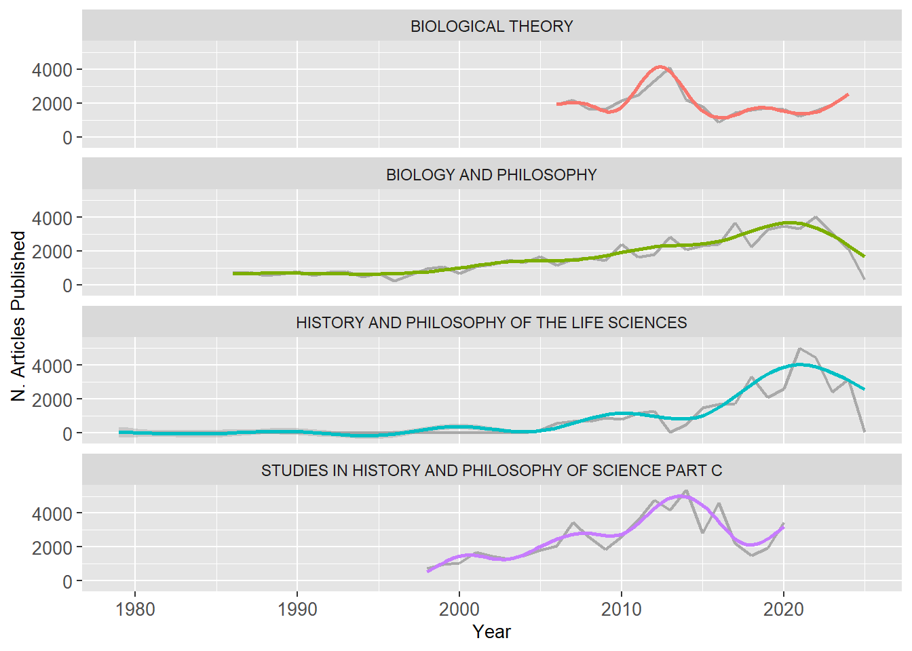
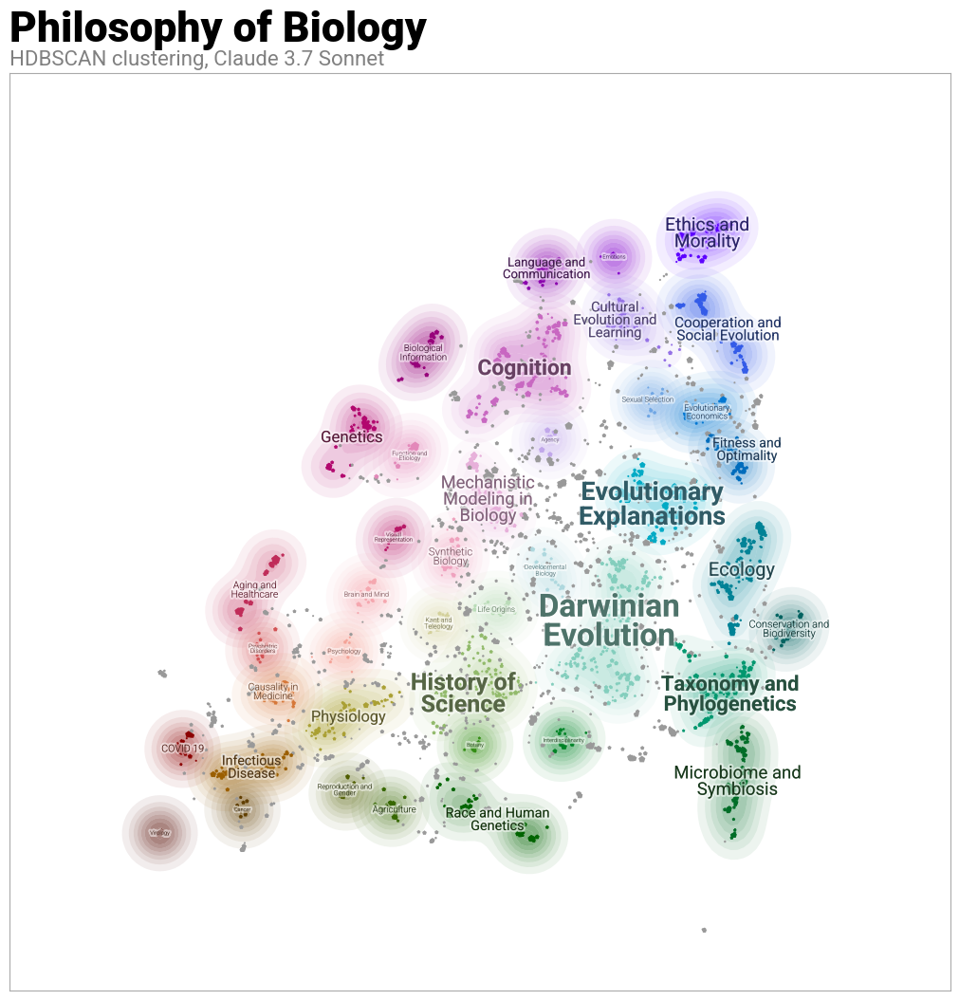

# WIPOB
This project is called "What is Philosophy of Biology" (WIPOP). Is is part of my master's thesis in philosophy of science. In this master, one of my goal was to investigate the thematic diversity of philosophy of biology. Given that it is often the case that philosophy of biology of biology discribes itself as on a continuum with biology, I wanted to know if the thematics of the two endeavors matched, at least partially. 

Some previous results, notably Gayon (2009), Pradeu (2017) and Malaterre et al. (2021) looked at the thematic diversity of philosophy of biology through one main journal : _Biology and Philosophy_. Gayon and Pradeu classified manually all the articles. The categories in which they fall have been built iteratively. Malaterre leveraged well-known topic modeling algorithm _Latent Dirichilet Allocation_ (LDA). Howerver, given that Gayon and Pradeu manual annotation attribute a unique theme per article whereas Malaterre with LDA gives the probability to find a topic in a document (which have many of them), the two analysis are hard to compare. 

Thus me decided to use a state of the art topic modeling algorithm : BERTopic (Grootendorst, 2022). With it, we were able to attribute a single theme by article, thus making our analysis comparable with the one of Pradeu, himself extending the previous work of Gayon. Moreover, we looked at the four major journals in philosophy of biology : 
| Journal                                                                 | Articles | References |
|-------------------------------------------------------------------------|----------|------------|
| BIOLOGY AND PHILOSOPHY                                                  | 1 273     | 63 647      |
| STUDIES IN HISTORY AND PHILOSOPHY OF SCIENCE PART C :STUDIES IN HISTORY AND PHILOSOPHY OF BIOLOGICAL AND BIOMEDICAL SCIENCES | 959      | 57 651      |
| HISTORY AND PHILOSOPHY OF THE LIFE SCIENCES                             | 892      | 35 108      |
| BIOLOGICAL THEORY                                                       | 607      | 34 460      |

These journals have not started at the same time and their respective productions have also different patterns. Here is a quick visualisation of those dynamics : 

## Topic Modeling using BERTopic 
Here, you will find the resulting map of philosophy of biology using BERTopic. For the various details of my utilisation of the algorithm, please refer to the notebook where everything is described. Also note that there is very good documentation about the algorithm [here](https://maartengr.github.io/BERTopic/api/bertopic.html). The visualisation was achieved using `datamaplot`. For more information, please also consult their [documentation](https://datamapplot.readthedocs.io/en/latest/api_interactive.html)

For the curious mind who would like to test out interactively please click [here](https://jacobhamelmottiez.github.io/WIPOB/BERTopic_philo_of_biology.html). This can show dynamically citations per article, keywords, journal from where an article was published and more. 

If you want to get a snapshot of some references in a cluster, hold `shift+left-click` and circle the point you want. 

## Jupyter Notebook
If one is curious about how to achieve similar representation, I share here the notebook I used for this project. Sadly, given that the data is proprietary, I cannot share it on this repository. However, for someone who has minimal knowledge of python and notebooks, this should be pretty straight foward. 
_The notebook will be added soon_

## References
1. Gayon, J. (2009). *Philosophy of Biology: An Historico-Critical Characterization*. In A. Brenner & J. Gayon (Eds.), *French Studies in the Philosophy of Science: Contemporary Research in France* (pp. 201-212). Springer Netherlands. [DOI](https://doi.org/10.1007/978-1-4020-9368-5_9)  
   <cite>https://doi.org/10.1007/978-1-4020-9368-5_9</cite>

2. Grootendorst, M. (2022, March 11). *BERTopic: Neural Topic Modeling with a Class-Based TF-IDF Procedure*. arXiv. [DOI](https://doi.org/10.48550/arXiv.2203.05794)  
   <cite>https://doi.org/10.48550/arXiv.2203.05794</cite>

3. Malaterre, C., Chartier, J.-F., & Pulizzotto, D. (2019). *What Is This Thing Called Philosophy of Science? A Computational Topic-Modeling Perspective, 1934–2015*. HOPOS: The Journal of the International Society for the History of Philosophy of Science, 9(2), 215-249. [DOI](https://doi.org/10.1086/704372)  
   <cite>https://doi.org/10.1086/704372</cite>

4. Pradeu, T. (2017). *Thirty Years of Biology & Philosophy: Philosophy of Which Biology?* Biology & Philosophy, 32(2), 149-167. [DOI](https://doi.org/10.1007/s10539-016-9558-7)  
   <cite>https://doi.org/10.1007/s10539-016-9558-7</cite>

